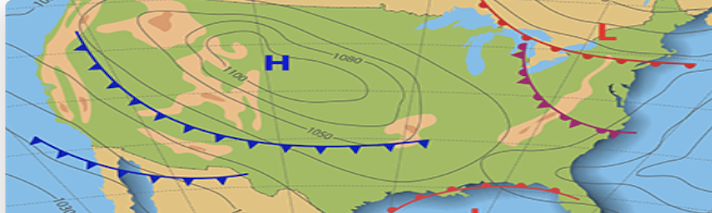
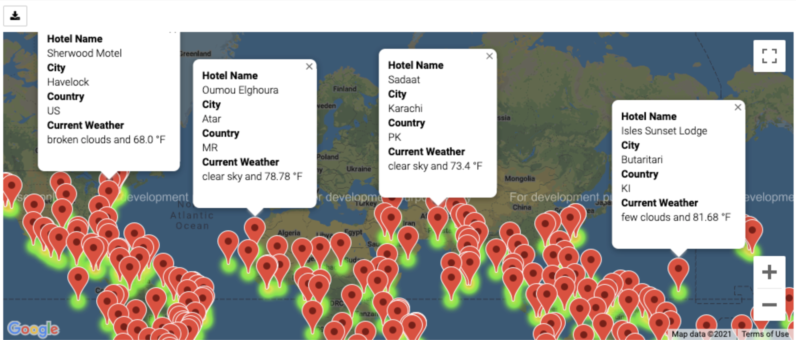
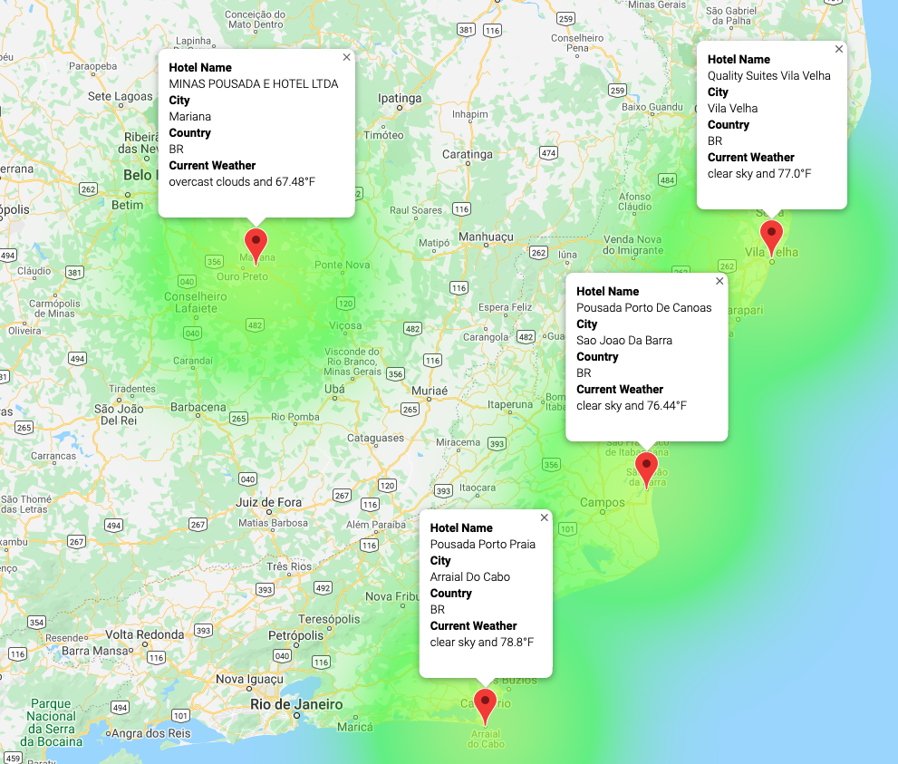
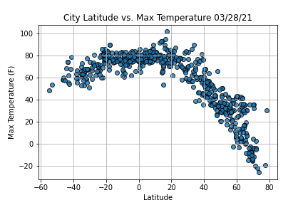
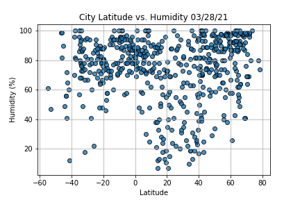
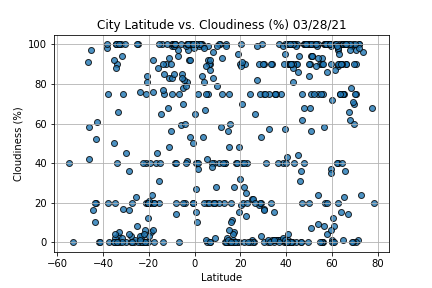
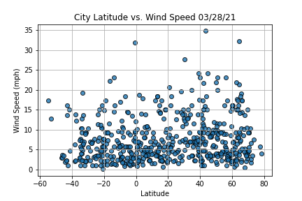

# World Weather Analysis

## Overview of the Analysis

The goal of this assignment was to provide real-time suggestions to make-believe clients regarding their travel plans. The job entailed searching for hotels within a given range of latitude and longitudes, and within range of preferred temperatures and other weather conditions (e.g., humidity, rain).

## Analysis

To Weather data was retrieved and used from an Application Programming Interface(API) "get" request to a server. Values were also retrieved and stored from a JSON array. Try and except blocks were used to resolve errors in addition to Python functions. 

To visualized the data, scatter plots (using the Matplotlib library) were created. Styles and features were also applied to the plot. Weather description was added to the weather data to enable beta testers, which use input statements to filter the data for weather preferences. This process allows users to identify potential travel destinations and nearby hotels.

The analysis was correctly executed using statistical skills. Linear regression was performed and regression lines were added to scatter plots. Finally, heatmaps with added markers using the Google Maps API were created for easier visualization.  

## Resources

- OpenWeatherMap
- Google Maps Platform
- Google API
- Pandas
- Matplotlib
- SciPy Statistics

## Maps and Plots

